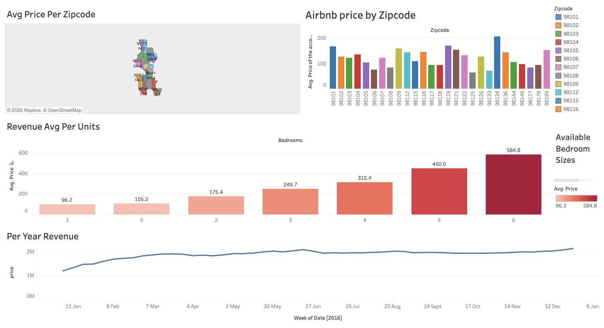

# Airbnb Revenue Analysis (Tableau)

A Tableau analysis of Airbnb listings to understand what drives rental revenue.

## Dashboard

**[View the interactive dashboard on Tableau Public →](https://public.tableau.com/app/profile/abir.hossain4647/viz/AirbnbRevenueAnalysis_17080290158200/Dashboard1)**

## What I did
- Profiled the dataset in Tableau to see what it contains and where data is missing
- Joined several tables (inner join) during data preparation
- Built calculations and aggregations, e.g. how the number of bedrooms affects revenue
- Combined the visuals into an interactive dashboard aimed at investors

## Tools
Tableau
